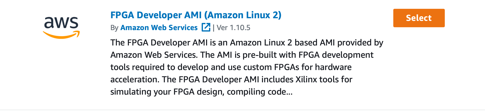
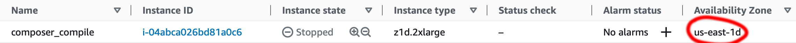

# Composer

The following instructions show what prerequisites are necessary to install and use Composer.
For information on _how_ to use Composer, see [here](doc/index.md).

# Prerequisites 

To use the Composer framework, the only necessary installations are [sbt](https://www.scala-sbt.org) and CMake.

Linux Installation:
```shell
sudo apt-get install cmake sbt
```

Mac(homebrew) Installation: (Note that these packages can be installed from source without homebrew)
```shell
brew install cmake sbt
```

sbt requires JDK 17 or older to run, the newer versions of Java will not work.
To check the current java version, use
```bash
java -version
```
To switch to java 17 within a specific terminal window, first [install it](https://www.oracle.com/java/technologies/javase/jdk17-archive-downloads.html) if it is not already installed, then use
```bash
JAVA_HOME=`/usr/libexec/java_home -v 17`
```

# Backends

### Verilator

We currently use a Verilator backend for simulation. We may add additional simulation backends in the future.
[Verilator Installation Link](https://verilator.org/guide/latest/install.html)
Do not use `brew` or `apt` to install Verilator as it may be an old version.
It _may_ work but is not guaranteed to be tested or functional.

### AWS F1

In order for the Composer tools to find the SDK, export the installation path to the `COMPOSER_AWS_SDK_DIR` variable
within your `.bashrc` file.

This entire process requires an Amazon AWS account.
Once you've aquired one of those, you will need two instances, a compile instance and a F1 instance.
F1 instances are generally more expensive than other instances, so this is just as a cost saving measure.
For your compile instance, prioritize fast single-core performance - Vivado and EDAs don't use a lot of parallelism, so tons of memory and a fast single-core will make this go faster.

**Important Note**: we require some more recent versions of cmake to build correctly and older versions of Linux (ie Amazon Linux 1) 
are a bit old for that. The default AMI (Amazon Linux 2) is fine for this. Amazon provides two AMIs for F1 usage, make sure
to select the Amazon Linux 2 version. Otherwise, you will be unable to build the Composer-Software/Composer-Runtime
backend.



For using the AWS-Composer backend, we provide an option from the setup script. Simply run the following.
It will ask for root permissions to install XDMA kernel drivers.
```shell
./setup -aws
```

Once you have a hardware module that you want to deploy, navigate to `Composer-Hardware/vsim` and perform the following.
```shell
export CL_DIR=`pwd`
composer-config
# The config script will ask if you want AWS backend (1).
# Say that you want that and then answer (y) to the next question.
cd build/scripts
./aws_build_dcp_from_cl.sh
# This will start the synthesis scripts in the background. At the very least it takes a couple hours.
# TODO - setup email notification of completion
```

A couple of hours later... If there were errors in compilation, you'll find those in the copious log files now 
scattered in the directory. Otherwise you should find a folder `build/checkpoints/to_aws` and a tarball within that
directory.
Navigate to `build/checkpoints/to_aws`.
```shell
# Final preparation of the image happens externally, need to setup some storage for that
# Set up your aws credentials
aws configure 
```
You can generate a new access key ID through the AWS website.
Once you're logged in, click on the top right (should be your username) > "Security Credentials" > "Access Keys",
and then generate the keys. Enter these into the `aws configure` script.
To find which zone you're in, it should be under the "instances" interface. 
If there's a letter at the end of the zone, discard it.
Below is an example of what it may look like. In this case you would provide `us-east-1` as your zone.


Now it's time to transfer your tarball to an S3 storage bucket.
```shell
aws s3 mb s3://<bucket_name> # "mb" means "make bucket"
# You can navigate the S3 storage system with a lot of the same command you would use in a normal FS (e.g. ls)
aws s3 mb s3://<bucket_name>/logs
touch my_log_file
aws s3 cp my_log_file s3://<bucket_name>/logs/ # This ending slash is very important!
aws s3 mb s3://<bucket_name>/<build_dir_name>/
aws s3 cp <name_of_tarball> s3://<bucket_name/<build_dir_name>/  # Remember ending slash

# Time to make the image
aws ec2 create-fpga image --region <your_zone_name> --name <your_image_name> --description <description_of_your_build> \
                          --input-storage-location Bucket=<bucket_name>,Key=<build_dir_name>/<name_of_tarball> \
                          --logs-storage-location Bucket=<bucket_name>,Key=logs/
```

This takes some more time to create, you can check on the status of the build with `aws ec2 describe-fpga-images --owner self`
Once you see "Status: Available", you're ready to flash the image onto the FPGA.

# Installation and Running

Assuming you now have `cmake`, `sbt`, and `verilator`, we can run simulations of some basic examples.
First, set up the repo. Make sure to `export COMPOSER_ROOT=` to the appropriate directory in your `.bashrc`.
Modify your `PATH` variable as well as directed.

```shell
git clone https://github.com/Composer-Team/Composer.git
cd Composer/
# inside Composer/
./setup.sh
```

Second, install the composer user library.
Composer uses CMake to find this library later on so make sure that if you are performing a local install that
CMake knows where to look.
Putting `export LD_RUN_PATH=$LD_RUN_PATH:<your_install_path>` in your `.bashrc` should do the trick.

```shell
cd Composer-Software
mkdir build
# For local builds, specify -DCMAKE_INSTALL_PREFIX=???
# For Debug builds, specify -DCMAKE_BUILD_TYPE=Debug
cmake ..
make
make install
```

Now we have everything we need to run some basic examples.
```shell
# Switch to hardware repo from software library repo
cd ../Composer-Hardware
# When prompted by sbt, run design.ExampleConfig (3)
sbt run
```

If you look in the `Composer-Hardware/vsim/generated-src/` directory, you will find `composer.v` and other files that
now contain our design.
Now we can run the simulation.
We suggest running the simulation of the FPGA in a separate window from the user software but it is possible to do this with one window as well.
In one window, build and run the simulator.
```shell
# Switch to runtime repo
cd ../Composer-Runtime/
mkdir build
cmake .. -TARGET=sim
make
./ComposerRuntime
# Now Verilator is running the design.ExamplesConfig 
```

In another window build and run the code examples.
```shell
# Switch to examples repo
cd ../Composer-Examples
mkdir build
cmake ..
make alu
./alu
make vector
./vector
```

Voila! Shut down the simulator in the other window with a ctrl+c. Now that the run is finished, there should be a `trace.vcd`
in the run directory. VCD waveforms can be viewed by a variety of programs and are an extremely productive debugging
tool for hardware. [GTKWave](https://gtkwave.sourceforge.net) is a popular, open-source, cross-platform tool for viewing
VCD waveforms.